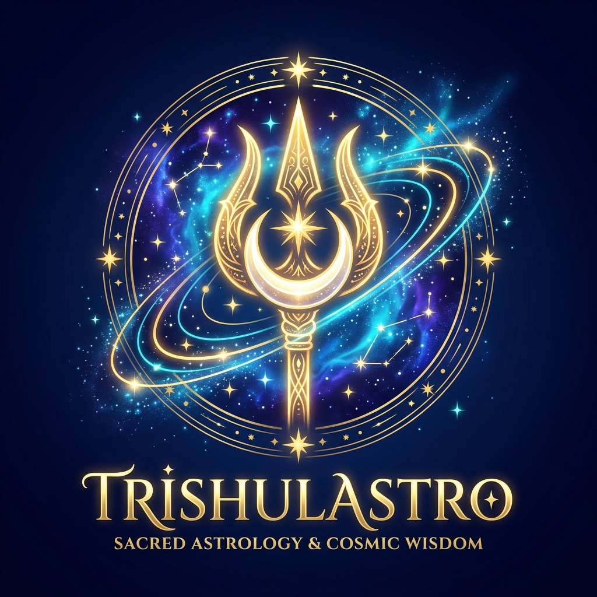

# TrishulAstro — Sacred Vedic Astrology & Cosmic Booking Platform

A luxury, full-featured Vedic astrology consultation website featuring an interactive celestial planetary hero, certified master astrologers directory, daily horoscope forecasts, free Janam Kundli calculator, and an end-to-end booking pass generator.



## Features

- **Celestial Planetary Showcase (Vedic Grahas)**:
  - Explores the sacred celestial forces: **Venus (Shukra)**, **Jupiter (Guru)**, **Mars (Mangal)**, **Saturn (Shani)**, **The Sun (Surya)**, **Mercury (Budha)**, and **The Moon (Chandra)**.
  - Earth removed and replaced with rich Vedic astrological significance, ruling deities, gemstones, auspicious days, and sacred Bija Mantras.
  - Interactive dual orbital switchers plus a 1-click Graha quick-dock.
- **Brand Identity**:
  - Custom vector TrishulAstro logo and favicon featuring Lord Shiva's Trishul, luminous crescent moon, and golden celestial orbits.
- **Vedic Consultation Packages**:
  - Complete Janam Kundli & Life Path (D1, D9 Navamsha, Mahadasha)
  - Career, Business & Wealth Yoga
  - Love, Marriage Compatibility & Kundli Milan
  - Urgent Prashna Kundli (Horary)
  - Gemstones & Karma Remedies
  - Vastu Shastra & Space Energy
- **Master Astrologers Directory**:
  - Verified profiles of Banaras and Vedic scholars (Pt. Radhe Krishna Shastri, Dr. Gayatri Devi, Acharya Devvrat Sharma, Acharya Vidyadhar Joshi).
- **Interactive Daily Horoscope & Rashiphal**:
  - Dynamic 12-sign zodiac picker (Aries through Pisces) with career, love, wealth, and health rating meters.
- **Free Instant Kundli & Transit Calculator**:
  - Computes Ascendant (Lagna), Moon Sign (Rashi), Sun Sign, and active Mahadasha with customized astrological synthesis.
- **Sacred Navaratna Remedies & Gemstone Sanctum**:
  - Detailed gemstone guide with authentic Prana Pratishtha energization advice.
- **Interactive Multi-Step Booking Wizard**:
  - 5-step seamless flow: Service selection, Astrologer selection, Muhurta/Slot picking, Birth data inputs, and Instant Vedic Booking Pass generation with Google Calendar sync.
- **Sacred 432Hz Om Chants Audio**:
  - Real-time synthesized harmonic drone with zero external dependencies.
- **Zero Broken Links & Zero Empty Buttons**:
  - Every button and link triggers responsive actions, modals, or smooth section navigation.

## Quick Start

Simply open `index.html` in any modern web browser or serve it locally via PowerShell / Python / Node:

```powershell
python -m http.server 8080
```
Then visit `http://localhost:8080/`.
